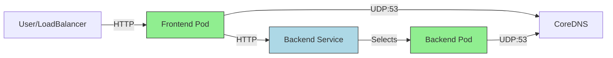
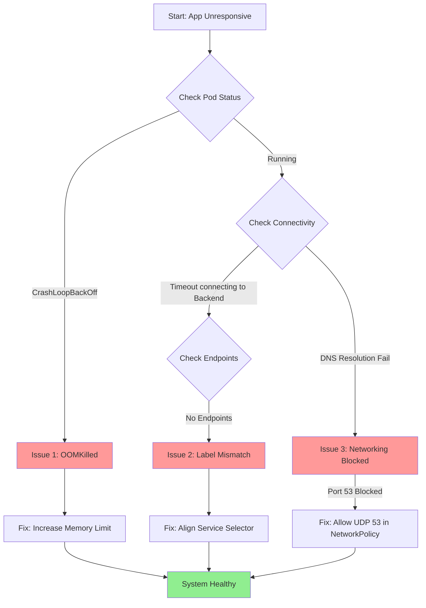

# SRE-II Challenge: Solution & Architecture

## 1. Executive Summary
This project resolves a simulated breakdown of a Kubernetes application involving Frontend crashes (OOM), Service Discovery failures, and Network connectivity blocks.

**Solution Approach**:
- **Helm Chart**: Implemented for reproducible deployments.
- **Toggles**: Configurable `simulateBroken` flag to switch between faulty and healthy states for demonstration.
- **Minikube**: Local validation environment.

---

## 2. Architecture & Debugging Workflow

### System Architecture
The following diagram illustrates the corrected flow where Frontend connects to Backend, and both can resolve DNS.



### Troubleshooting Flow (RCA)
This flowchart depicts the debugging process used to identify the three root causes.



---

## 3. Incident Analysis (RCA)

### Issue 1: Frontend OOMKilled
**Diagnosis**: Pod status showed `OOMKilled`. Limit was strict `256Mi`.
**Fix**: Updated `values.yaml` to set limit `512Mi` in fixed mode.

### Issue 2: Service Discovery (Label Mismatch)
**Diagnosis**: `backend-svc` selected `app: backend` but pods had `app: backend-api`.
**Fix**: Corrected selector in `backend-service.yaml` template to `app: backend-api`.

### Issue 3: DNS Blocked
**Diagnosis**: `NetworkPolicy` defaulted to deny-all egress without whitelisting DNS (Port 53).
**Fix**: Added explicit rule for UDP/53 egress in `network-policy.yaml`.

---

## 4. How to Run (Helm)

### Prerequisites
- `minikube`
- `helm`

### Installation
1. **Start Minikube**:
   ```bash
   minikube start
   ```

2. **Deploy (Broken State)**:
   ```bash
   helm install challenge ./chart/sre-challenge --set simulateBroken=true
   ```

3. **Deploy (Fixed State)**:
   ```bash
   helm upgrade challenge ./chart/sre-challenge --set simulateBroken=false
   ```

## 5. Production Enhancements (SRE Best Practices)
To prevent recurrence and ensure reliability, we implemented a **Production-Grade Helm Chart**:

### A. Scalability & Availability
*   **Horizontal Pod Autoscaler (HPA)**: Automatically scales Frontend pods (2-10 replicas) based on CPU usage (>70%).
*   **Pod Disruption Budget (PDB)**: Ensures at least 1 replica is always available during node maintenance.
*   **StatefulSet (Redis)**: Implemented persistent storage (1Gi PVC) for the database layer, ensuring data survival across restarts.

### B. Observability
*   **ServiceMonitor**: Configured to auto-scrape metrics by Prometheus.
*   **Prometheus Rules**: Added custom alerts:
    *   `FrontendHighMemory`: Alerts if memory > 400MB.
    *   `BackendDown`: Alerts if the backend service has no endpoints.

### C. Security & Deployment
*   **NetworkPolicy**: Locked down egress traffic (Whitelist-only).
*   **Helm**: Templatized configuration allows managing Environment specs (Dev/Prod) via `values.yaml` without duplication.

